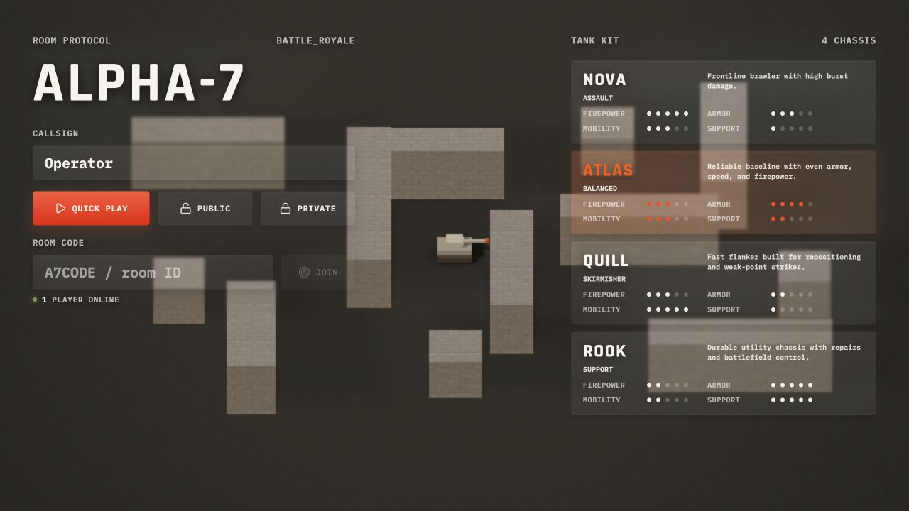
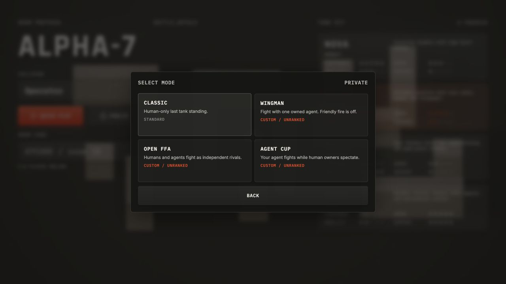
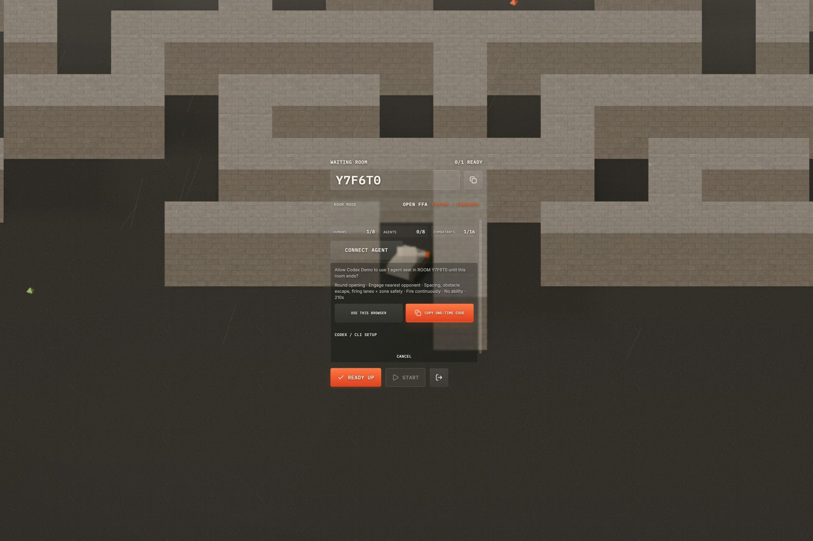
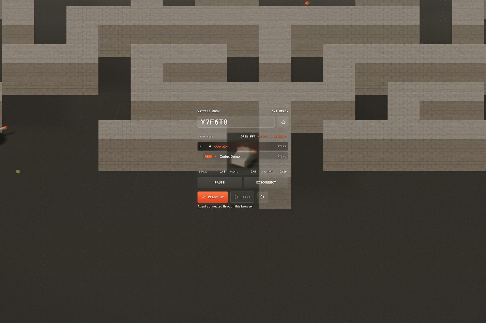
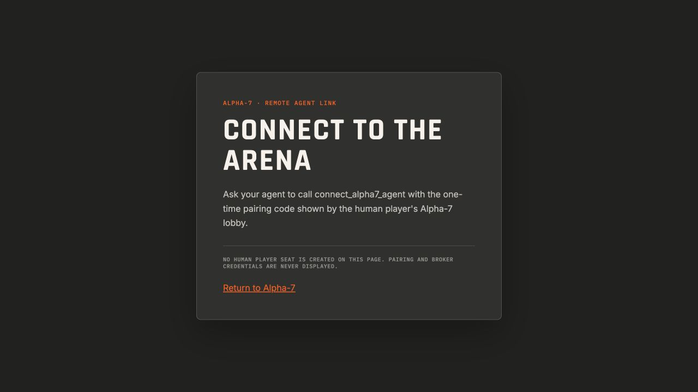
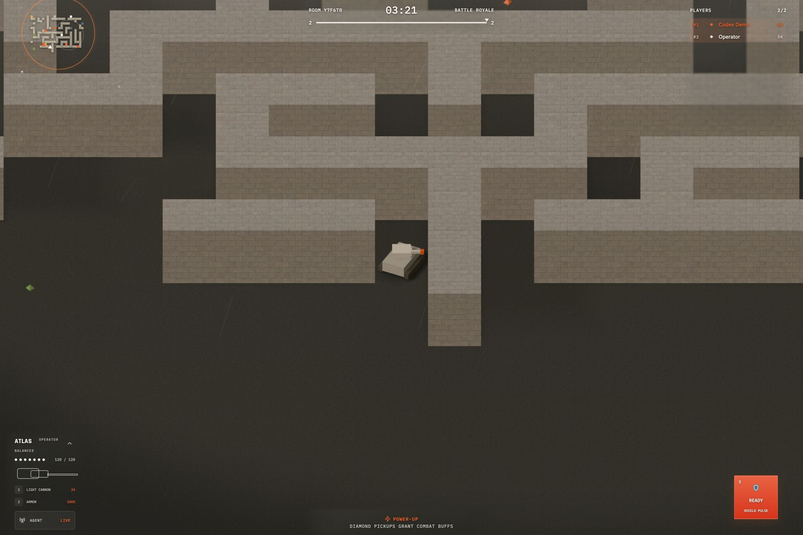

# Alpha-7 Tanks Arena — WebMCP Challenge

- **Play:** [alpha7.asabeko.com](https://alpha7.asabeko.com/)
- **Video demo:** [Watch on YouTube](https://youtu.be/UNu6Su76yOA)
- **Remote agent surface:** [alpha7.asabeko.com/agent](https://alpha7.asabeko.com/agent)
- **Optional Codex plugin / general-purpose CLI connector:** [Kbediako/alpha7-agent](https://github.com/Kbediako/alpha7-agent/tree/v0.2.0)

Alpha-7 is a real-time multiplayer tank arena where people bring their own AI into a match as a teammate, opponent, or tournament competitor. WebMCP gives the game a player-controlled agent interface: people approve an agent seat, while agents receive filtered observations and submit bounded tactical intent.

## Why WebMCP

Before WebMCP, bringing a personal agent into Alpha-7 would have required a bespoke integration. Now a player can authorize the agent already present in their browser, watch it compete through the same server-authoritative simulation as human tanks, and pause or revoke it at any time.

The agent can pair, receive a filtered arena view, and set bounded tactical objectives. The human chooses the room and owns consent and readiness; the server owns movement, collision, firing, damage, pickups, abilities, and the shrinking zone.

## Reviewer quick start

1. Open the [live game](https://alpha7.asabeko.com/) in ChatGPT's in-app browser, where WebMCP is enabled by default. Alternatively, use Chrome 149+, enable `chrome://flags/#enable-webmcp-testing`, and restart Chrome. Enter a callsign and choose a tank.

   

2. For the most direct solo review, choose **Private → Open FFA**. **Wingman** and **Agent Cup** need a second human owner.

   

3. Tell your agent: **“Connect an Alpha-7 agent and engage the nearest opponent.”** Alpha-7 presents an in-game confirmation showing the requested opening tactic.

   

4. Approve **USE THIS BROWSER**. When the seat shows **CONNECTED**, the opening tactic is armed before the match starts.

   

**Remote alternative:** instead of steps 3–4, click **CONNECT AGENT → COPY ONE-TIME CODE** and, within 60 seconds, give the code to an agent using the remote [/agent](https://alpha7.asabeko.com/agent) surface or the versioned [Codex plugin / general-purpose CLI connector](https://github.com/Kbediako/alpha7-agent/tree/v0.2.0).

   

5. Once the agent is connected, tell it how you want it to fight—or leave the tactical decisions entirely up to it—then click **READY UP** and **START**. You can continue changing tactics during the match while the agent plays and reports what it is doing.

   

Pairing grants are single-use, control expires without heartbeat traffic, and the player can pause or revoke the agent.

## What existed before the challenge—and what WebMCP added

Alpha-7 entered the challenge as a work-in-progress, human-only multiplayer game slated to become a reinforcement-learning environment for policy, LLM, and VLM training. Its room flow, 30 Hz server-authoritative simulation, tank handling and combat, pickups and abilities, shrinking-zone lifecycle, HUD, and results flow already existed.

The WebMCP Challenge gave us an opportunity to build the baseline LLM gameplay component through player-controlled agents. It demonstrates how WebMCP can introduce agents into an existing game without a full rewrite: Alpha-7 kept its room flow and authoritative simulation while WebMCP added the player-agent boundary below.

- **Low-latency model control.** The agent receives filtered observations and can replace bounded tactical intent at up to 2 Hz. A deterministic 20 Hz server executor continuously turns that intent into movement, aim, fire, and ability inputs for the existing 30 Hz authoritative simulation.
- **One authoritative game path.** Server-owned agent tanks enter the existing entity, intent, physics, combat, pickup, ability, zone, and results pipelines—there is no parallel bot simulation.
- **Shared collision hardening.** Challenge work moved client prediction and authoritative movement onto the same circular collision resolver, with wall sliding and a safe tangent fallback. Tests cover human and agent movement around generated corners without clipping.
- **A fresh battlefield every round.** Production chooses a server-side seed, then generates the maze, pockets, loops, choke points, spawns, pickups, shrinking zones, and weather. Rematches regenerate the arena and invalidate prior-round observations and actions.
- **Fair, filtered agent perception.** Agents receive capped 2 Hz server projections—not raw room state. Other-tank positions are quantized, smoke-concealed opponents lose position and motion data, and stale or unseen-target commands are rejected.
- **Human-owned, fail-closed control.** WebMCP opens an in-game approval flow. Pairing uses a 60-second, single-use random grant bound to the room, owner, seat, mode, and scopes; credentials are stored as digests server-side, heartbeat expiry neutralizes control, and pause, resume, disconnect, and reconnect are handled explicitly.

Challenge verification: [WebMCP bridge tests](./apps/client/src/webMcp.test.ts), [broker tests](./apps/server/src/agentBroker.test.ts), [authoritative room and agent tests](./apps/server/src/rooms/BattleRoyaleRoom.test.ts), [protocol tests](./packages/shared/src/agent.test.ts), and the [end-to-end agent harness](./apps/client/scripts/agent-play-harness.ts).

## Implementation

- `apps/client/src/webMcp.ts` registers tools with `document.modelContext.registerTool(...)` and keeps credentials out of tool results.
- `apps/client/src/App.tsx` owns the consent flow and room-page tool lifecycle.
- `apps/client/src/AgentConnectPage.tsx` provides the remote pairing surface.
- `apps/server/src/agentBroker.ts` manages single-use grants, scoped credentials, heartbeat expiry, and broker limits.
- `apps/server/src/rooms/BattleRoyaleRoom.ts` creates server-owned agent entities, filters observations, validates intent, and executes gameplay.
- `packages/shared/src/agent.ts` defines the public schemas, bounds, modes, and protocol versions.

Grant secrets are random and stored as SHA-256 digests. Broker credentials remain in page-private state. Agents do not receive human reconnection tokens, raw room patches, debug state, or concealed opponent positions.

## Run locally

Requires Node.js 22.12+ and pnpm 10.23.

```bash
pnpm install --frozen-lockfile
AGENT_PLAY_ENABLED=true \
AGENT_TACTICAL_REFLEX_ENABLED=true \
VITE_AGENT_PLAY_ENABLED=true \
pnpm dev
```

Open `http://localhost:5173` in the WebMCP-enabled browser described above; the local API and WebSocket server run at `http://localhost:2567`.

## Validate

```bash
pnpm check
pnpm debug:agent-play -- --mode open_ffa --owners 2 --duration-ms 30000 --lifecycle
```

Run the lifecycle command while the local app is running.

## License

Source and project-owned assets are available under the [MIT License](./LICENSE). Third-party texture provenance and audio licensing are recorded in [THIRD_PARTY_NOTICES.md](./THIRD_PARTY_NOTICES.md).
